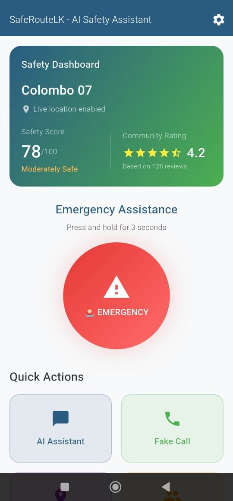
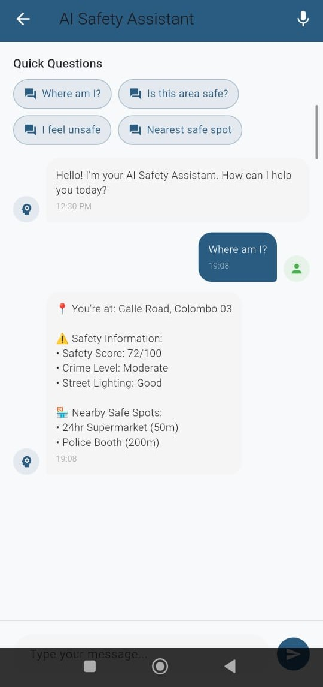
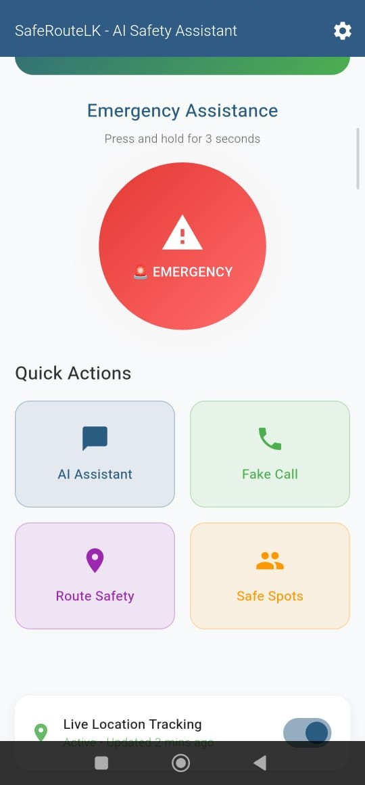
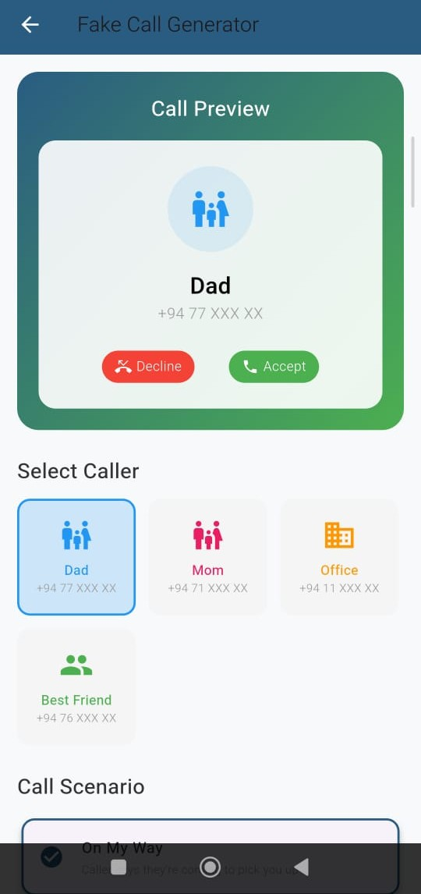
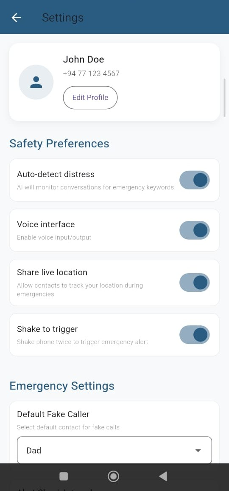
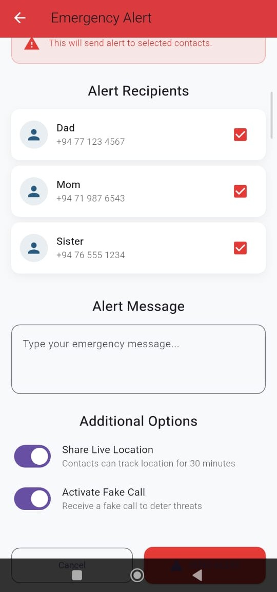

#  SafeRouteLK - AI Safety Assistant

<div align="center">


[](https://flutter.dev)
[](https://dart.dev)
[](LICENSE)
[](https://flutter.dev)

**AI-Powered Safety Navigation App for Urban Areas**

*A Final Year Project Proof of Concept - Objective 2: AI Real-time Call Assist & Alert System*

</div>

##  UI Screenshots

<div align="center">

###  Home Screen

*Safety dashboard with emergency button and quick actions*

###  AI Chatbot

*Intelligent AI assistant with emergency detection*

###  Emergency Alert

*Multi-contact emergency alert system*

###  Fake Call Generator

*Discreet fake calls for threat deterrence*

###  Settings

*User preferences and emergency contact management*

###  Alert Confirmation

*Emergency alert activation confirmation*

</div>

##  Features

###  Emergency Assistance
- **One-Tap Emergency Button** - Press and hold for 3 seconds
- **Multi-Contact Alerts** - Send SMS to multiple emergency contacts
- **Live Location Sharing** - Real-time location tracking
- **Fake Call Generation** - Discreet threat deterrence system

###  AI Safety Assistant
- **Natural Language Processing** - Understands safety-related queries
- **Emergency Detection** - Monitors conversations for distress keywords
- **Location-Aware Responses** - Provides area-specific safety information
- **Voice Interface** - Hands-free operation support

###  User Experience
- **Modern UI/UX** - Material Design 3 implementation
- **Safety Dashboard** - Real-time safety scores and ratings
- **Quick Actions** - One-tap access to essential features
- **Dark/Light Mode** - Customizable theme options

##  Technology Stack

| Component | Technology |
|-----------|------------|
| **Framework** | Flutter 3.0+ |
| **Language** | Dart 3.0+ |
| **State Management** | Provider |
| **UI Design** | Material Design 3 |
| **Development Tools** | VS Code / Android Studio |
| **Version Control** | Git |

##  Getting Started

### Prerequisites

- **Flutter SDK** (Version 3.0 or higher)
- **Android Studio** or **VS Code** with Flutter extension
- **Android Emulator** or **Physical Device**
- **Git** (for version control)

### Installation

1. **Clone the repository**
   ```bash
   git clone https://github.com/your-username/SafeRouteLK-UI-PoC.git
   cd SafeRouteLK-UI-PoC